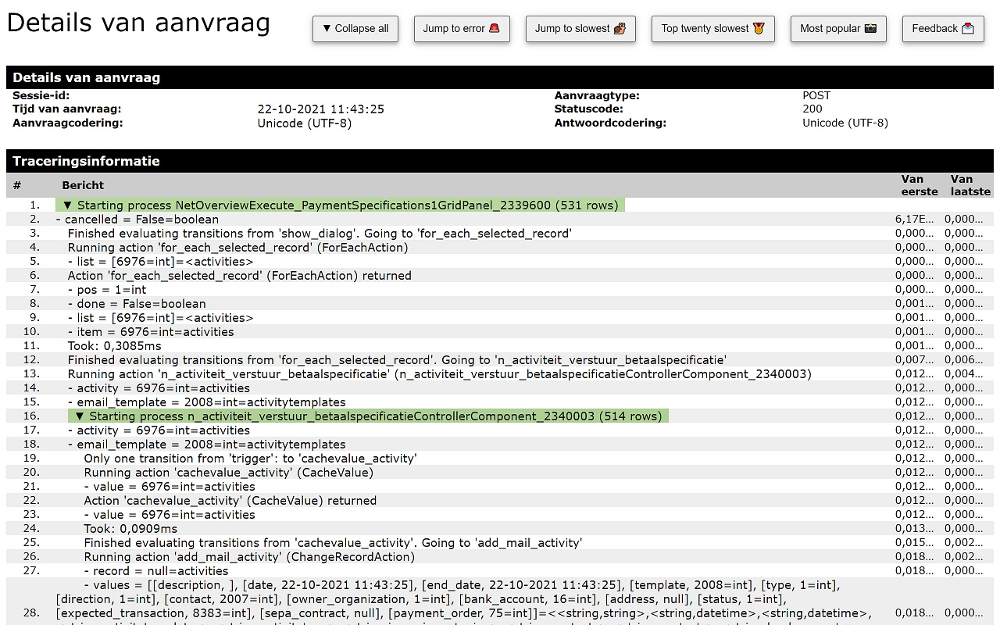
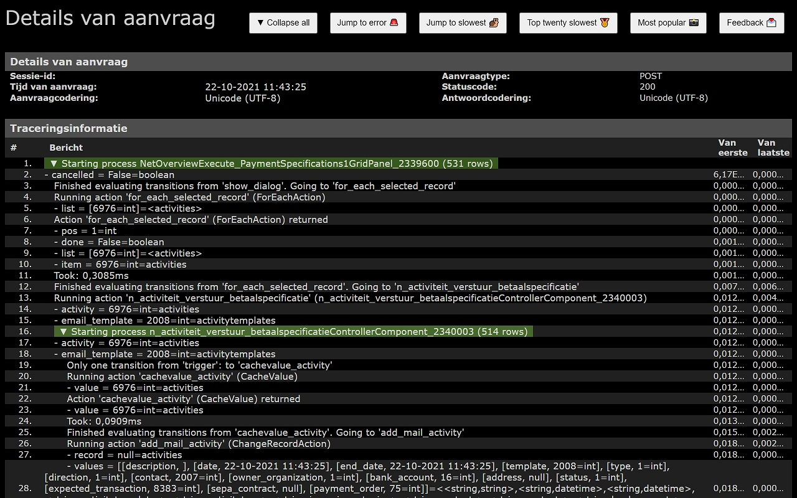

# NovuloTraceformatter
Enables collapsing and expanding of rows in a Novulo trace and highlights slow process actions.

With the add-on enabled you can analyse a trace file more easily by using the buttons on the top right corner of the screen and the expand/collapse buttons on some rows.

Visit the following websites to view a demo "Novulo Trace" and to test the add-on.

https://joachimbatzke.com/addons/DemoTrace.axd.htm

https://joachimbatzke.com/addons/Demo2Trace.axd.htm

Add it to firefox:
https://addons.mozilla.org/de/firefox/addon/novulotraceformatter/

Add it to chrome:
https://chrome.google.com/webstore/detail/novulotraceformatter/aoncjcaidgjomhdkjfkbflaeejlamdif
